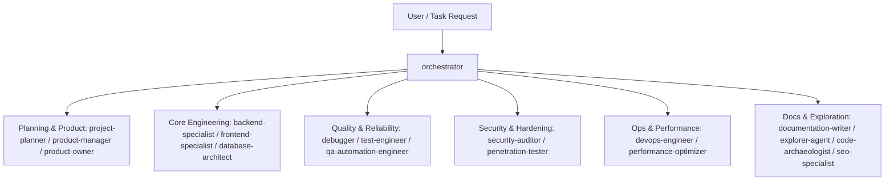

# Subagent Roles

Agentic Instructions deploys a comprehensive team of 18 specialized agent roles into `.agents/agents/` to handle end-to-end software engineering, architecture, testing, security, and optimization tasks.

---

## Agent Directory & Categories



---

## Complete Catalog of Agent Roles

| Agent | Focus Area | Description |
|---|---|---|
| **`orchestrator`** | Coordination | High-level coordinator that manages task graphs, decomposes complex objectives, and synthesizes outputs across multiple specialized agents. |
| **`project-planner`** | Planning & Architecture | Generates comprehensive implementation specs, technical blueprints, and execution milestones before code is modified. |
| **`product-manager`** | Requirements | Translates business goals into technical requirements, user stories, and acceptance criteria. |
| **`product-owner`** | Scope & Prioritization | Evaluates trade-offs, defines feature scope, and verifies deliverables meet user intent. |
| **`backend-specialist`** | Server & API | Expert backend architect for Node.js, Python, Go, and serverless/edge systems (REST, GraphQL, tRPC, database integration). |
| **`frontend-specialist`** | UI/UX & Web | Frontend engineer for React, Next.js, Vue, TailwindCSS, accessibility, responsive design, and micro-interactions. |
| **`database-architect`** | Data Modeling | Designs relational/document schemas, migration strategies, indexing, and query performance optimizations. |
| **`devops-engineer`** | CI/CD & Cloud | Manages Docker containers, deployment pipelines, infrastructure-as-code, and release orchestration. |
| **`debugger`** | Defect Isolation | Investigates failures systematically, reproduces root causes with minimal reproductions, and applies verified fixes. |
| **`test-engineer`** | Testing & TDD | Formulates test strategies, unit tests, integration tests, and edge-case test matrices. |
| **`qa-automation-engineer`** | E2E & Automation | Implements browser automation (Playwright, Cypress) and regression suites. |
| **`security-auditor`** | Vulnerability Scan | Audits source code for OWASP Top 10 vulnerabilities, dependency risks, and credential leaks. |
| **`penetration-tester`** | Threat Modeling | Simulates adversarial attacks, identifies bypass vulnerabilities, and recommends defense-in-depth hardening. |
| **`performance-optimizer`** | Profiling & Speed | Diagnoses memory leaks, CPU hotspots, bundle sizes, rendering bottlenecks, and database query latency. |
| **`code-archaeologist`** | Legacy & Exploration | Analyzes legacy codebases, traces undocumented dependencies, and prepares refactoring roadmaps. |
| **`documentation-writer`** | Docs & Specs | Authors technical documentation, API references, architecture decision records (ADRs), and user guides. |
| **`explorer-agent`** | Codebase Traversal | Rapidly navigates complex project trees, locates relevant functions and modules, and provides structural context. |
| **`seo-specialist`** | Search & Metadata | Optimizes semantic HTML, OpenGraph tags, JSON-LD structured data, and search engine discoverability. |

---

## Agent Definition Format

Each agent in `agents/<name>.md` contains YAML frontmatter defining its tools, skills, and activation triggers:

```markdown
---
name: backend-specialist
description: Expert backend architect for Node.js, Python, and modern serverless/edge systems.
tools: Read, Grep, Glob, Bash, Edit, Write
model: inherit
version: 1.0.0
skills: clean-code, nodejs-best-practices, python-patterns, api-patterns, database-design
---

# Backend Development Architect
...
```
