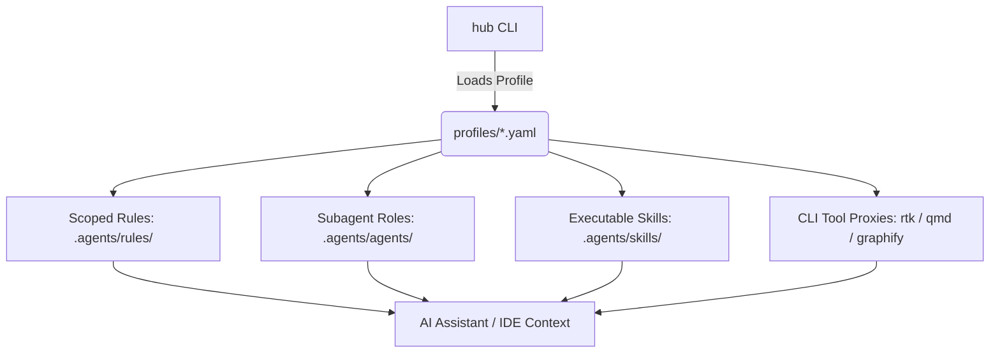

# Agentic Instructions

**Agentic Instructions (`hub`)** is a production-grade configuration hub and CLI designed to inject curated instructions, scoped rules, specialized subagents, execution skills, and token-saving proxies into modern AI coding assistants (such as Google Antigravity, Claude Code, and Cursor).

---

## Key Highlights

- **🎯 Scoped Rules (`.agents/rules/`)**: Language and domain rules injected dynamically based on file glob triggers and event matching (`always_on` for global tools, `glob` for language guidelines).
- **🤖 7 Core Subagent Roles (`.agents/agents/`)**: Specialized autonomous personas (`pre-planner`, `feature-coder`, `tdd-driver`, `repro-debugger`, `refactor-cleaner`, `pr-preflight`, `orchestrator`).
- **⚡ Token-Optimized CLI Proxies (`rtk`, `qmd`, `graphify`)**: 60-90% token compression on tool outputs and instant AST/semantic dependency queries.
- **🛠️ Executable Skills (`.agents/skills/`)**: Pre-packaged, runnable bash workflows for testing, linting, formatting, dependency auditing, and Git hygiene.
- **📦 11 Out-of-the-Box Profiles**: Tailored stacks for Go, Rust, Python, TypeScript, Nextflow DSL2, R Biostatistics, Machine Learning, Security Auditing, and Technical Writing.

---

## Architecture Overview



---

## Directory Structure

```
.
├── hub.sh                  # Main CLI entrypoint
├── install.sh              # One-step installer
├── mkdocs.yml              # Documentation system configuration
├── profiles/               # Stack profile manifests (11 curated profiles)
├── instructions/           # Composable instruction fragments
│   ├── tech/               # Plain markdown language guides + companion .yaml configs
│   └── tools/              # Token-dense tool guides (rtk, qmd, graphify) + .yaml configs
├── agents/                 # Generic subagent definitions with frontmatter
├── skills/                 # Runnable bash skill scripts with frontmatter definitions
├── platforms/              # Platform deployment configurations (Antigravity, etc.)
├── docs/                   # Complete documentation source
└── tests/                  # Modular test and CI suite
```
